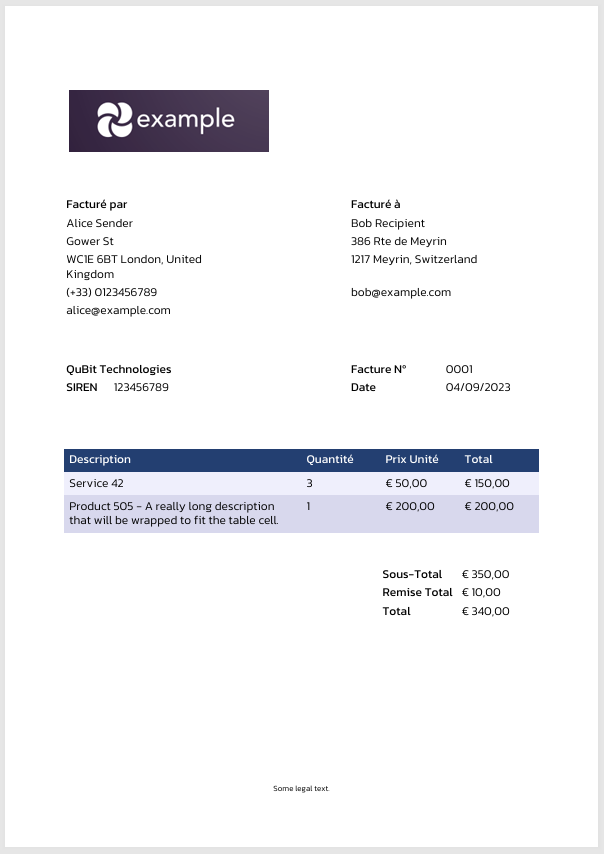

# KSC Invoicing: A PDF Invoice Generator
A PDF invoice generator by Koppanyi Scientific Consulting.

## Description
A Python tool for generating PDF invoices with some basic customisation using the borb pdf library.
Primarily designed to generate legally compliant pdf invoices for freelancers under the French micro-enterprise status.

The invoice data is primarily provided through json but can be adapted through the use of the package API (and integrated
with a separate invoicing system for example). A plain-text log file keeps track of invoice numbers for the basic use case.

## Features
- Generates professional PDF invoices (made specifically for French auto-entrepreneurs).
- Easy JSON-based input (see `example_config/invoice.json`)
- Customisable fonts and colours (see `config/`)
- Tracks invoice numbers automatically (via a log file)
- Supports english and french language
- Supports invoices in multiple currencies (EUR, USD, GBP and CHF)

## Directory Structure
- `kscinvoicing/` — Core package
- `config/` — Fonts and style config
- `example_config/` — Example input files and logo
- `tests/` — Unit tests
- `scripts/` — Example scripts for using the package API


## Installation

### Conda
```shell
conda env create -f env.yaml
conda activate kscinvoicing

```

You can run the tests to ensure everything is working properly.
```shell
python -m unittest discover tests
```

## How to Use

Invoices can be generated from the command line as follows:
```shell
python -m kscinvoicing.cli .\example_config\invoice.json

```
It is also possible to generate invoices via the package API. See the examples in `scripts/` for more details. 

Example output:


### Fonts
Fonts can be customised in `config/style.json` by supplying the path to a `.ttf` file. 
If no font is supplied, the default font will be used which is packaged with this repository.
The fonts used here were obtained from [Google Fonts](https://fonts.google.com/?preview.layout=grid&lang=en_Latn) 
and have Open Font Licences. 


## TODO
- Add more layout customisation options
- Add more unit tests


## Disclaimer
This software is provided "as-is" without any warranty.
