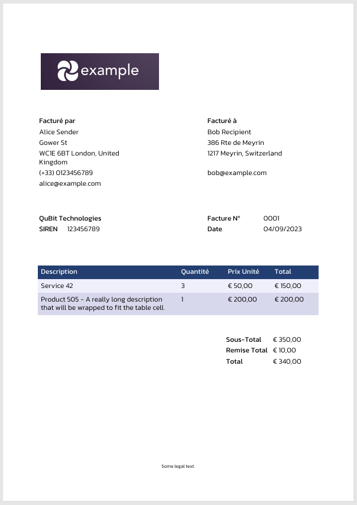

# KSC Invoicing: A PDF Invoice Generator
A PDF invoice generator by Koppanyi Scientific Consulting.

## Description
A Python tool for generating PDF invoices using the borb PDF library.
Primarily designed to generate legally compliant PDF invoices for freelancers under the French micro-enterprise status.

Invoices can be created through a **web UI** (recommended) or directly from the **command line** using a JSON file.
Invoice history is tracked automatically in a local SQLite database.

> **⚠️ Important notice regarding French invoicing regulations**
>
> Due to changes in French law, **this tool should not be used for managing invoices after 1 September 2026**.
> From that date, all businesses must use certified electronic invoicing software compliant with the new government system. This tool does not hold that certification.

## Features
- Generates professional PDF invoices (designed for French auto-entrepreneurs)
- Web UI for managing sender profile, clients, and invoice generation
- Tracks invoice history with payment status (unpaid / paid / overdue)
- JSON-based CLI input for scripted or automated use
- Supports French and English language
- Supports EUR, USD, GBP, and CHF currencies
- Customisable fonts and colours (see `config/`)

## Directory Structure
```
kscinvoicing/        Core package
config/              Fonts and style configuration
example_config/      Example invoice JSON and logo
tests/               Unit tests
kscinvoicing_data/   Runtime data: sender profile, clients, invoice DB (auto-created)
invoices/            Default PDF output folder (auto-created)
```

## Installation

```shell
uv sync
```

Run the tests to verify everything is working:
```shell
uv run pytest tests/
```

---

## Web UI (Recommended)

Launch the Streamlit web interface:
```shell
kscinvoicing serve
```

Or with custom host/port:
```shell
kscinvoicing serve --port 8080 --host 0.0.0.0
```

The UI has four tabs:

### Generate Invoice
1. Select your sender profile (set up once in the **Sender Profile** tab)
2. Select a client from your saved clients (manage them in the **Manage Clients** tab)
3. Add line items — descriptions, quantities, and unit prices
4. Configure invoice date, due date, currency, language, discount, and tax rate
5. Click **Generate Invoice** to produce and download the PDF

### Manage Clients
Add, edit, and delete client records (individuals or companies). Clients are saved locally and available in the Generate Invoice tab.

### Sender Profile
Configure your own details: name, company, SIREN, address, email, phone, logo path, and footer text (e.g. legal notice). This only needs to be set up once.

### Invoice History
View all past invoices with their date, client, total, and payment status. You can:
- Filter by status: All / Unpaid / Paid / Overdue
- Mark invoices as paid or unpaid
- Expand an invoice to view its line items
- Delete an invoice (requires confirmation)

---

## CLI

Generate an invoice from a JSON file:
```shell
kscinvoicing generate example_config/invoice.json
```

Add `--no-preview` to skip the interactive preview step:
```shell
kscinvoicing generate example_config/invoice.json --no-preview
```

### JSON format

See `example_config/invoice.json` for a full example. Key fields:

```json
{
  "logo_path": "./example_config/example_logo.png",
  "save_location": "./invoices",
  "invoice_date": "2023-09-04",
  "currency": "EUR",
  "language": "fr",
  "discount": 0,
  "footer_text": "Your legal notice here.",
  "sender": {
    "name": "Alice Sender",
    "company": "My Company",
    "siren": "123456789",
    "email": "alice@example.com",
    "phone": "(+33) 0123456789",
    "address": { "number": "1", "street": "Rue Example", "postcode": "75001", "city": "Paris", "country": "France" }
  },
  "recipient": {
    "name": "Bob Recipient",
    "email": "bob@example.com",
    "address": { "number": "386", "street": "Rte de Meyrin", "postcode": "1217", "city": "Meyrin", "country": "Switzerland" }
  },
  "lineitem_details": [
    { "description": "Consulting services", "quantity": 3, "price_per_unit": 50.00 }
  ]
}
```

---

## Customisation

### Fonts
Fonts can be changed in `config/style.json` by supplying a path to a `.ttf` file.
The default fonts are bundled with the repository and sourced from [Google Fonts](https://fonts.google.com/) under Open Font Licences.

### Colours
Edit `config/style.json` or `kscinvoicing/pdf/utils.py` to adjust the colour scheme.

---

## Example Output



---

## Acknowledgements

The web UI for this project was developed with the assistance of [Claude Code](https://claude.ai/code) by Anthropic.

## License

This project uses borb (https://github.com/jorisschellekens/borb),
which is licensed under the AGPL-3.0 or commercial license.

If you use this software, you must comply with the AGPL-3.0 terms.
